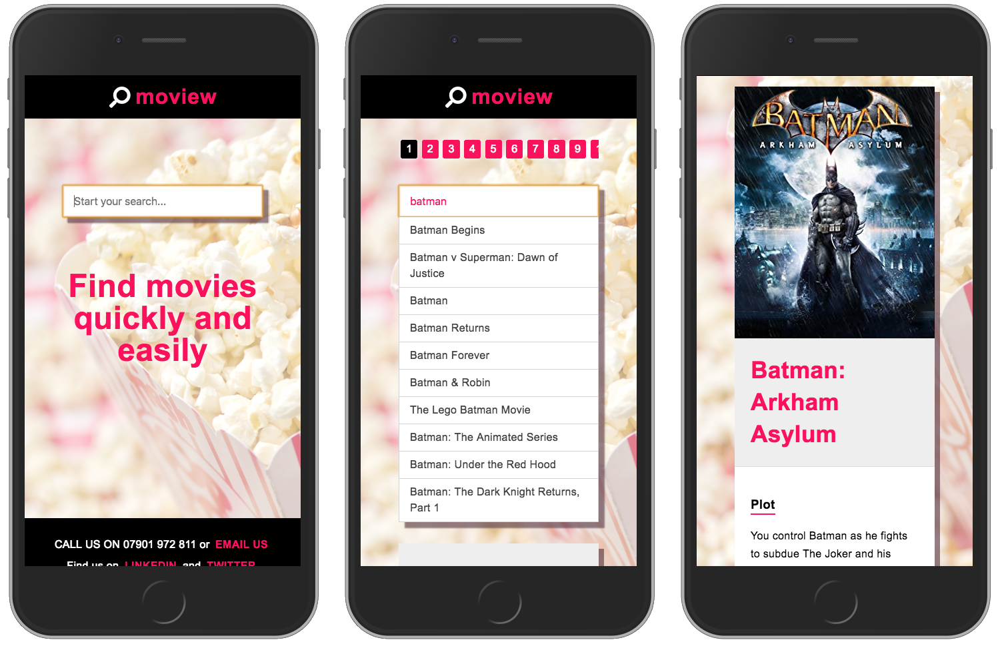
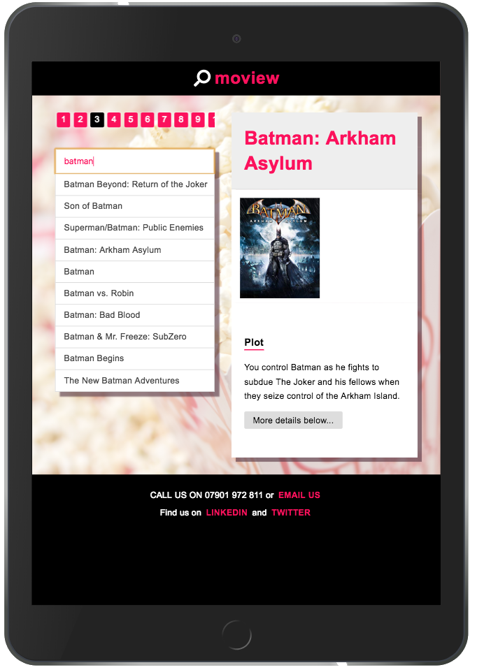

 
 

# Moviewer
## A movie search engine
**Moviewer** is the first React project I made on the [Constructor Labs bootcamp](https://constructorlabs.com/) I attended in 2018. The data is fetched from the [Open Movie Database API](http://www.omdbapi.com) . Enter a search term and see the search results instantly with full details of the movie. It has a responsive layout for mobile and desktop screen sizes giving a user-friendly experience.

> [View the live demo](https://moviewer.rolandjlevy.repl.co/)

> [View the new repo on Github](https://github.com/rolandjlevy/moview)
> 
> [View the orignal repo on Github](https://github.com/rolandjlevy/moview)

## Functionality and features
+ The app first captures the search input and fetches data that matches the input from the Open Movie Database API. 
+ The app then uses React and CSS to display the data returned by the API as pages which are lists of 10 links per page. 
+ Each link has a unique ID which is used to identify the selected movie from the API.
+ Each time a movie is selected, the title, poster image, description and other details are displayed

## Technology used
+ React
+ CSS, Classnames and Flex-box
+ Open Movie Database API

## Stages of development
+ Set up API and read the Open Movie Database API documentation 
+ Created functionality for the initial search query
+ Created smart pagination, with scrolling to see all results
+ Retrieved the data for selected movie 
+ Used React to display the poster image, year, IMDB rating, director and description
+ Used CSS to style the UI

## Features
+ Responsive search preview - results are updated each time a letter is entered and shown below the search box
+ Smart pagination allows users to quickly navigate all pages of the search results
+ Form validation gives the user feedback and details of results:
> + if the search input is more or less than 3 letters
> + if the search input has returned a valid result or not
> + How many results and pages of results have been found

## Desired features with more time
+ Improve the desktop view for better responsiveness
+ Allow users to mark movies as favourites and use localStorage to save the favourites into a sortable list
+ Added a featured movies section
+ Include infinate scrolling with the initial results
+ Use the [Youtube API](https://developers.google.com/youtube/v3/) to load a trailer into the detailed results area
